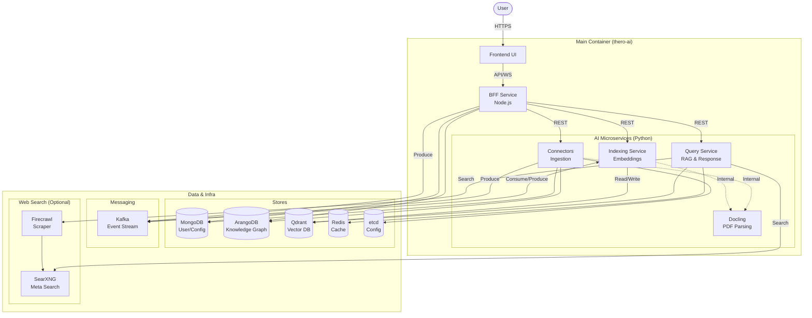

# Thero AI

Welcome to Thero AI, a comprehensive, multi-component platform for advanced knowledge management, question-answering, and intelligent data processing. This project is designed for developers who want to build and extend a powerful AI-driven application.

## Architecture Overview

Thero AI utilizes a microservices-inspired architecture, but for ease of development and deployment, all core application services are bundled and run within a single Docker container (`thero-ai`). This container houses the frontend, a backend-for-frontend (BFF), and several specialized Python-based AI services.

This central application container is orchestrated via Docker Compose, which also manages a suite of external backing services like databases, messaging queues, and a vector store.

Here is a diagram illustrating the overall architecture:



### Components

*   **Frontend:** A rich, client-side application built with React and Material-UI. It provides the user interface for all the platform's features.
*   **Backend for Frontend (BFF):** A Node.js (Express) service that serves the frontend, handles user authentication (including various OAuth providers), manages user data, and acts as a gateway to the AI services.
*   **AI Services:** A collection of Python services responsible for the core AI functionality:
    *   **Query Service:** Handles user queries, interacts with the vector database (`Qdrant`), and generates responses.
    *   **Indexing Service:** Manages the creation and updating of vector embeddings for documents and knowledge sources.
    *   **Connectors Service:** Connects to various external data sources to ingest data.
    *   **Docling Service:** Microservice for PDF processing and document parsing.
    *   **Web Search Stack:** Dedicated stack for web search capabilities using SearXNG and Firecrawl.

## Tech Stack

| Component               | Technology                                                                                                                                                              |
| ----------------------- | ----------------------------------------------------------------------------------------------------------------------------------------------------------------------- |
| **Frontend**            | React, Vite, TypeScript, Material-UI (MUI), Redux Toolkit, React Router, Emotion, i18next                                                                                |
| **Backend (BFF)**       | Node.js, Express, TypeScript, MongoDB, ArangoDB, Passport.js (for Auth), Kafka (kafkajs), WebSockets (socket.io), Zod                                                     |
| **Backend (AI Services)** | Python, FastAPI, Langchain, Qdrant, NATS, Kafka, Celery, Spacy, Sentence-Transformers, ArangoDB, Redis                                                                    |
| **Deployment**          | Docker, Docker Compose                                                                                                                                                  |
| **Backing Services**    | MongoDB, Redis, ArangoDB, etcd, Kafka (with Zookeeper), Qdrant                                                                                                          |

## Project Structure

```
.
├── deployment/              # Docker Compose files and deployment scripts
│   └── docker-compose/
├── frontend/                # React frontend source code
├── services/                # Backend services source code
│   ├── nodejs/              # Node.js BFF service
│   └── python/              # Python AI services
├── Dockerfile               # Root Dockerfile to build the main `thero-ai` image
└── README.md                # This file
```

## Getting Started

Follow these steps to get the Thero AI platform running on your local machine.

### Prerequisites

*   [Docker](https://docs.docker.com/get-docker/)
*   [Docker Compose](https://docs.docker.com/compose/install/)

Make sure Docker is running before proceeding.

### 1. Configuration

The project uses environment variables for configuration. The main `docker-compose.dev.yml` file references several variables that you should configure.

While the docker-compose file provides default values for development, it is good practice to create a local `.env` file in the project root to manage your configuration, especially for secrets.

You can start by copying one of the templates, for example from `services/python/env.template`. A minimal `.env` file in the project root could look like this:

```env
# Example .env file in the project root
# These passwords will be used to initialize the databases.
ARANGO_PASSWORD=your_secure_password
MONGO_PASSWORD=your_secure_password
SECRET_KEY=your_very_secret_key
QDRANT_API_KEY=your_qdrant_api_key
```

#### Bootstrapping AI model configuration

The Node.js backend can now seed the AI model configuration automatically on first start. Provide one of the following environment variables (for example in `services/nodejs/apps/.env` or your runtime secrets) before launching the stack:

- `AI_MODELS_CONFIG` – raw JSON string with your `llm`, `embedding`, etc. definitions
- `AI_MODELS_CONFIG_BASE64` – base64-encoded version of the same JSON (handy for CI)
- `AI_MODELS_CONFIG_FILE` – path to a JSON file mounted into the container

If none of these variables are present, the platform will expect you to configure models manually later.

### 2. Build and Run the Application

Once your configuration is in place, you can start the entire stack using the development Docker Compose file.

```sh
docker-compose -f deployment/docker-compose/docker-compose.dev.yml up --build
```

This command will:
1.  Build the main `thero-ai` Docker image from the root `Dockerfile`. This step can take a while on the first run as it downloads dependencies and ML models.
2.  Pull and start all the backing services (MongoDB, Kafka, etc.).
3.  Start the `thero-ai` service, which runs the frontend, BFF, and AI services.

## Services and Ports

The application will be accessible at `http://localhost:3000`.

The `docker-compose.dev.yml` file exposes several ports. Here are the most important ones:

| Service               | Port on Host | Description                                                              |
| --------------------- | ------------ | ------------------------------------------------------------------------ |
| **Frontend**          | `3000`       | The main web application UI.                                             |
| **AI Query Service**    | `8001`       | Direct access to the Python Query service API.                           |
| **AI Connectors**     | `8088`       | Direct access to the Python Connectors service API.                      |
| **AI Indexing**       | `8091`       | Direct access to the Python Indexing service API.                        |
| **MongoDB**           | `27017`      | Database for the Node.js BFF.                                            |
| **Redis**             | `6379`       | In-memory store for caching and messaging.                               |
| **ArangoDB**          | `8529`       | Multi-model database used by both Node.js and Python services.           |
| **Qdrant**            | `6333`       | Vector database UI/API.                                                  |
| **Docling Service**   | `8081`       | PDF processing service.                                                  |
| **SearXNG**           | `8085`       | Meta-search engine UI/API.                                               |
| **Firecrawl API**     | `3002`       | Web scraping and crawling API.                                           |

You can now navigate to `http://localhost:3000` in your browser to use the application.

## Development Setup

For local development without Docker, you can run each service individually. This setup provides better debugging capabilities and faster iteration cycles.

### System Dependencies

#### Linux

```bash
sudo apt update
sudo apt install python3.10-venv
sudo apt-get install libreoffice
sudo apt install ocrmypdf tesseract-ocr ghostscript unpaper qpdf
```

#### Mac

```bash
# Install Homebrew if not already installed
/bin/bash -c "$(curl -fsSL https://raw.githubusercontent.com/Homebrew/install/HEAD/install.sh)"

# Install required packages
brew install python@3.10
brew install libreoffice
brew install ocrmypdf tesseract ghostscript unpaper qpdf

# Install optional packages
brew install tesseract
```

#### Windows

- Install Python 3.10
- Install Tesseract OCR if you need to test OCR functionality
- Consider using WSL2 for a Linux-like environment

### Application Dependencies

1. **Docker** - Install Docker for your platform
2. **Node.js** - Install Node.js (v22.15.0)
3. **Python 3.10** - Install as shown above
4. **Optional debugging tools:**
   - MongoDB Compass or Studio 3T
   - etcd-manager

### Starting Required Docker Containers

**Redis:**
```bash
docker run -d --name redis --restart always -p 6379:6379 redis:bookworm
```

**Qdrant:** (API Key must match with .env)
```bash
docker run -p 6333:6333 -p 6334:6334 -e QDRANT__SERVICE__API_KEY=your_qdrant_api_key qdrant/qdrant:v1.13.6
```

**ETCD Server:**
```bash
docker run -d --name etcd-server --restart always -p 2379:2379 -p 2380:2380 quay.io/coreos/etcd:v3.5.17 /usr/local/bin/etcd \
  --name etcd0 \
  --data-dir /etcd-data \
  --listen-client-urls http://0.0.0.0:2379 \
  --advertise-client-urls http://0.0.0.0:2379 \
  --listen-peer-urls http://0.0.0.0:2380
```

**ArangoDB:** (Password must match with .env)
```bash
docker run -e ARANGO_ROOT_PASSWORD=your_arango_password -p 8529:8529 --name arango --restart always -d arangodb:3.12.4
```

**MongoDB:** (Password must match with .env MONGO URI)
```bash
docker run -d --name mongodb --restart always -p 27017:27017 \
  -e MONGO_INITDB_ROOT_USERNAME=admin \
  -e MONGO_INITDB_ROOT_PASSWORD=password \
  mongo:8.0.6
```

**Zookeeper:**
```bash
docker run -d --name zookeeper --restart always -p 2181:2181 \
  -e ZOOKEEPER_CLIENT_PORT=2181 \
  -e ZOOKEEPER_TICK_TIME=2000 \
  confluentinc/cp-zookeeper:7.9.0
```

**Apache Kafka:**
```bash
docker run -d --name kafka --restart always --link zookeeper:zookeeper -p 9092:9092 \
  -e KAFKA_BROKER_ID=1 \
  -e KAFKA_ZOOKEEPER_CONNECT=zookeeper:2181 \
  -e KAFKA_ADVERTISED_LISTENERS=PLAINTEXT://localhost:9092 \
  -e KAFKA_LISTENER_SECURITY_PROTOCOL_MAP=PLAINTEXT:PLAINTEXT \
  -e KAFKA_INTER_BROKER_LISTENER_NAME=PLAINTEXT \
  -e KAFKA_OFFSETS_TOPIC_REPLICATION_FACTOR=1 \
  confluentinc/cp-kafka:7.9.0
```

### Starting Node.js Backend Service

```bash
cd services/nodejs/apps
cp ../../env.template .env  # Create .env file from template
npm install
npm run dev
```

### Starting Python Backend Services

```bash
cd services/python
cp ../env.template .env
# Create and activate virtual environment
python3.10 -m venv venv
source venv/bin/activate  # On Windows: venv\Scripts\activate

# Install dependencies
pip install -e .

# Install additional language models
python -m spacy download en_core_web_sm
python -c "import nltk; nltk.download('punkt')"

# Run each service in a separate terminal
python -m app.connectors_main
python -m app.indexing_main
python -m app.query_main
python -m app.docling_main
```

### Starting Web Search Stack

For web search capabilities (SearXNG + Firecrawl), run the dedicated Docker Compose stack:

```bash
docker-compose -f deployment/docker-compose/docker-compose.websearch.yml up
```

### Setting Up Frontend

```bash
cd frontend
cp env.template .env  # Modify port if Node.js backend uses a different one
npm install
npm run dev
``` 

## AI backend config and health checks (new)

Node resolves the AI backend from the centralized configuration, not just from env. On first run it will populate `/services/endpoints` with defaults derived from env.

- Key location: `/services/endpoints` (JSON in etcd)
- AI backend key: `queryBackend.endpoint`
- Fallback if key is missing: `QUERY_BACKEND` environment variable (defaults to `http://localhost:8000`)

Python Query service (FastAPI) serves AI routes under `/api/v1` on port 8000 (inside container; mapped to 8001 on host). Ensure it is running before saving AI model configs in the UI.

Quick checks:

```bash
# Inside container / local dev default
curl http://localhost:8000/health

# From host when using the dev compose mapping
curl http://localhost:8001/health

# LLM health (requires Authorization header)
curl -X POST http://localhost:8000/api/v1/llm-health-check \
  -H 'Content-Type: application/json' \
  -H 'Authorization: Bearer <JWT>' \
  -d '[{"provider":"openAI","configuration":{"model":"gpt-4o-mini","apiKey":"sk-..."},"isMultimodal":false,"isDefault":true}]'
```

If you see "fetch failed" when saving AI model configuration, verify:
- Python Query service is reachable on the URL stored at `/services/endpoints` → `queryBackend.endpoint`.
- Your Node `.env` has `QUERY_BACKEND` correct for local runs.
- Authorization header is passed for `/api/v1/*health*` endpoints.